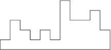

# Letra

> Una máquina tiene que pintar una pared con diferentes alturas como la imagen siguiente:
>
> 
>
> Esta máquina tiene la característica que sólo pinta de forma horizontal. Cada trazo horizontal que realiza la máquina tiene un alto fijo y ancho arbitrario que depende de la pared que se desea pintar.
>
> La dificultad se encuentra en calcular la cantidad mínima de trazos horizontales que debe realizar la máquina para poder pintar la pared completa. En el caso del ejemplo, la máquina debe realizar 9 pasadas entre todos los pisos.
>
> La entrada de datos que define la pared viene dada por una serie de números separados por un espacio que determina la altura de la pared para ese piso y sección de la pared. En el caso del ejemplo, los datos serían 1, 3, 2, 1, 2, 1, 5, 3, 3, 4, 2. Dado los siguientes datos de entrada, determinar cuantos trazos horizontales mínimos debe realizar la máquina para pintar la pared de forma completa.
>
> 1 4 5 6 7 8 15 12 9 4 9 8 12 14 22 45 67 89 87 86 85 23 56 67 21 88 11 44 56 91 67 45 45 45 45 45 44 21 89 90 90 87 45 91 12 45 57

# Método

Eran largas horas de la noche, no quería programar más así que grafiqué la pared en [Google Sheets](https://docs.google.com/spreadsheets/d/1ELs8_OlV6TqAoXJrOphpQaSXuxFMvV4P41t3vny-UWg) y conté tanto lo rojo como lo blanco :joy:  jaja

# Solución

> 452
